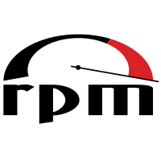

# dnf 解析

```
Something I hope you know before go into the coding~
First, please watch or star this repo, I'll be more happy if you follow me.
Bug report, questions and discussion are welcome, you can post an issue or pull a request.
```




Package manager based on libdnf and libsolv. Replaces YUM.

Dandified YUM (DNF) is the next upcoming major version of YUM. It does package management using RPM, libsolv and hawkey libraries. For metadata handling and package downloads it utilizes librepo. To process and effectively handle the comps data it uses libcomps.

## 相关站点

* 官方代码仓库: <https://github.com/rpm-software-management/dnf>

## 目录

* [解析](docs/解析.md)
    * [yum如何解析repodata](docs/解析/yum如何解析repodata.md)
    * [yum漏洞更新操作](docs/解析/yum漏洞更新操作.md)


## 图示


---
