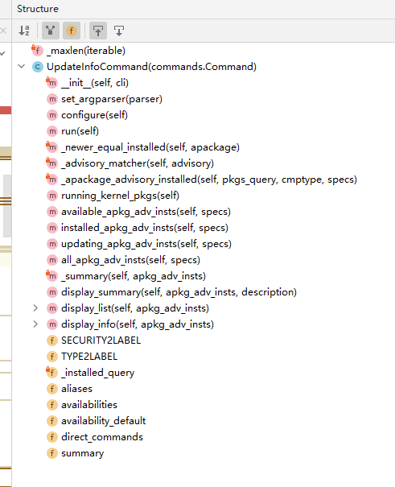
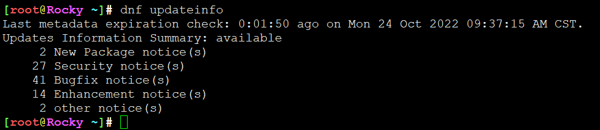
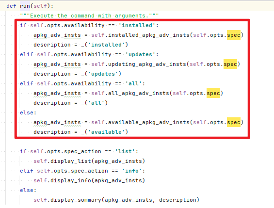
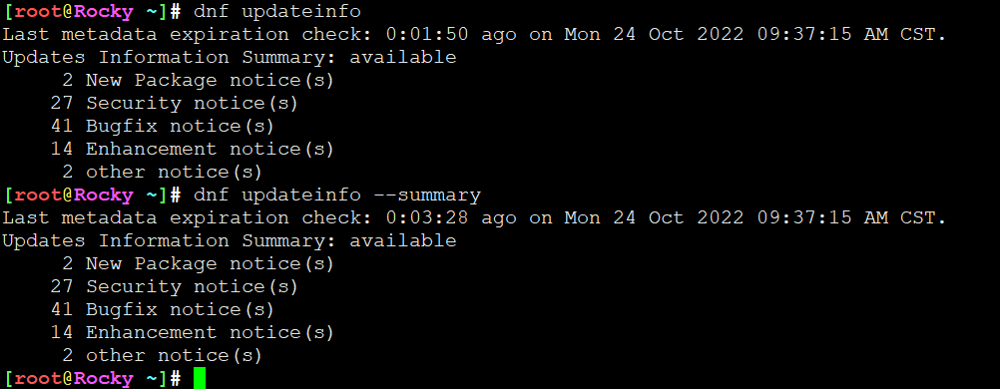
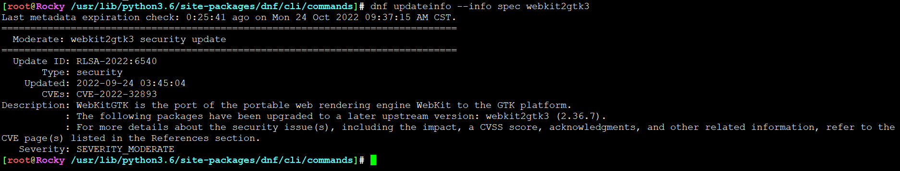
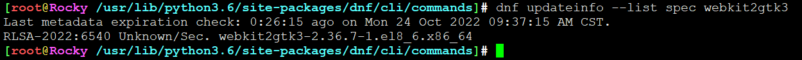
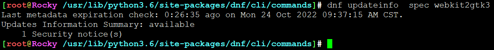
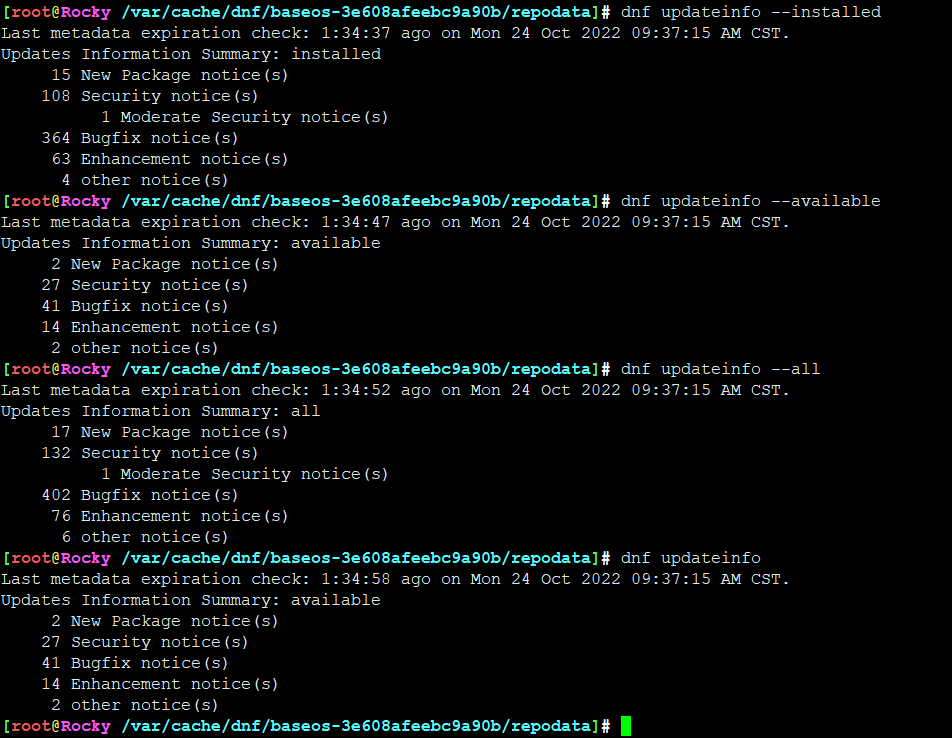
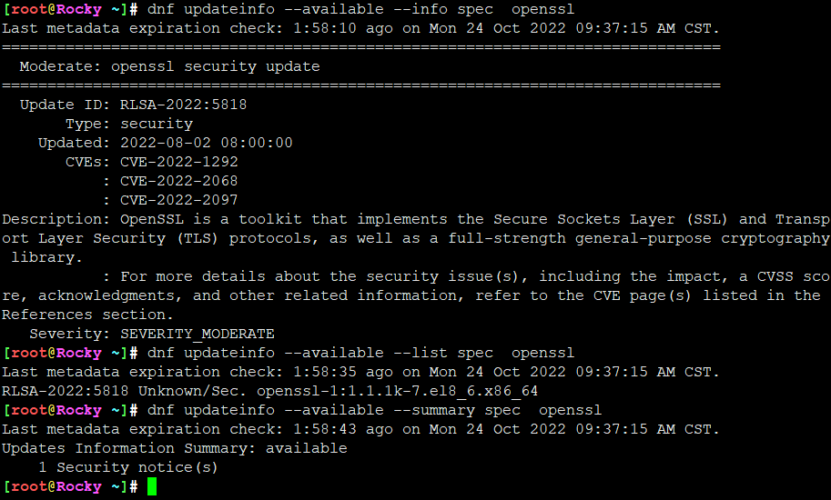
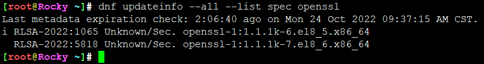

# dnf中updateinfo命令代码跟踪

## dnf updateinfo

```
/usr/lib/python3.6/site-packages/dnf/cli/commands/updateinfo.py
```








默认就是带summay



基本步骤，

1. 实例化 ```class UpdateInfoCommand()```，执行 ```def __init__(self, cli)```
2. 执行静态方法```def set_argparser(parser):```
3. 执行配置，基于参数解析配置各种标志位，```def configure(self):```
4. 跳转具体dao方法，状态机+跳转 ```def run(self):```
5. 结束


## dnf updateinfo --summary


## dnf updateinfo --list


## dnf updateinfo --info


## 用法示例











 


---
