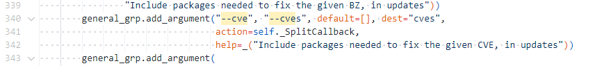

# yum漏洞更新操作

```
[root@Rocky /data/dnf-4.7.0.git]# yum help
usage: yum [options] COMMAND

List of Main Commands:

alias                     List or create command aliases
autoremove                remove all unneeded packages that were originally installed as dependencies
check                     check for problems in the packagedb
check-update              check for available package upgrades
clean                     remove cached data
deplist                   [deprecated, use repoquery --deplist] List package's dependencies and what packages provide them
distro-sync               synchronize installed packages to the latest available versions
downgrade                 Downgrade a package
group                     display, or use, the groups information
help                      display a helpful usage message
history                   display, or use, the transaction history
info                      display details about a package or group of packages
install                   install a package or packages on your system
list                      list a package or groups of packages
makecache                 generate the metadata cache
mark                      mark or unmark installed packages as installed by user.
module                    Interact with Modules.
provides                  find what package provides the given value
reinstall                 reinstall a package
remove                    remove a package or packages from your system
repolist                  display the configured software repositories
repoquery                 search for packages matching keyword
repository-packages       run commands on top of all packages in given repository
search                    search package details for the given string
shell                     run an interactive YUM shell
swap                      run an interactive YUM mod for remove and install one spec
updateinfo                display advisories about packages
upgrade                   upgrade a package or packages on your system
upgrade-minimal           upgrade, but only 'newest' package match which fixes a problem that affects your system

List of Plugin Commands:

builddep                  Install build dependencies for package or spec file
changelog                 Show changelog data of packages
config-manager            manage yum configuration options and repositories
copr                      Interact with Copr repositories.
debug-dump                dump information about installed rpm packages to file
debug-restore             restore packages recorded in debug-dump file
debuginfo-install         install debuginfo packages
download                  Download package to current directory
groups-manager            create and edit groups metadata file
kpatch                    Toggles automatic installation of kpatch-patch packages
needs-restarting          determine updated binaries that need restarting
playground                Interact with Playground repository.
repoclosure               Display a list of unresolved dependencies for repositories
repodiff                  List differences between two sets of repositories
repograph                 Output a full package dependency graph in dot format
repomanage                Manage a directory of rpm packages
reposync                  download all packages from remote repo
uploadprofile             Upload combined profile to Satellite server (list of installed rpms, enabled repositories and modules

display a helpful usage message

General YUM options:
  -c [config file], --config [config file]
                        config file location
  -q, --quiet           quiet operation
  -v, --verbose         verbose operation
  --version             show YUM version and exit
  --installroot [path]  set install root
  --nodocs              do not install documentations
  --noplugins           disable all plugins
  --enableplugin [plugin]
                        enable plugins by name
  --disableplugin [plugin]
                        disable plugins by name
  --releasever RELEASEVER
                        override the value of $releasever in config and repo
                        files
  --setopt SETOPTS      set arbitrary config and repo options
  --skip-broken         resolve depsolve problems by skipping packages
  -h, --help, --help-cmd
                        show command help
  --allowerasing        allow erasing of installed packages to resolve
                        dependencies
  -b, --best            try the best available package versions in
                        transactions.
  --nobest              do not limit the transaction to the best candidate
  -C, --cacheonly       run entirely from system cache, don't update cache
  -R [minutes], --randomwait [minutes]
                        maximum command wait time
  -d [debug level], --debuglevel [debug level]
                        debugging output level
  --debugsolver         dumps detailed solving results into files
  --showduplicates      show duplicates, in repos, in list/search commands
  -e ERRORLEVEL, --errorlevel ERRORLEVEL
                        error output level
  --obsoletes           enables yum's obsoletes processing logic for upgrade
                        or display capabilities that the package obsoletes for
                        info, list and repoquery
  --rpmverbosity [debug level name]
                        debugging output level for rpm
  -y, --assumeyes       automatically answer yes for all questions
  --assumeno            automatically answer no for all questions
  --enablerepo [repo]   Enable additional repositories. List option. Supports
                        globs, can be specified multiple times.
  --disablerepo [repo]  Disable repositories. List option. Supports globs, can
                        be specified multiple times.
  --repo [repo], --repoid [repo]
                        enable just specific repositories by an id or a glob,
                        can be specified multiple times
  --enable              enable repos with config-manager command
                        (automatically saves)
  --disable             disable repos with config-manager command
                        (automatically saves)
  -x [package], --exclude [package], --excludepkgs [package]
                        exclude packages by name or glob
  --disableexcludes [repo], --disableexcludepkgs [repo]
                        disable excludepkgs
  --repofrompath [repo,path]
                        label and path to an additional repository to use
                        (same path as in a baseurl), can be specified multiple
                        times.
  --noautoremove        disable removal of dependencies that are no longer
                        used
  --nogpgcheck          disable gpg signature checking (if RPM policy allows)
  --color COLOR         control whether color is used
  --refresh             set metadata as expired before running the command
  -4                    resolve to IPv4 addresses only
  -6                    resolve to IPv6 addresses only
  --destdir DESTDIR, --downloaddir DESTDIR
                        set directory to copy packages to
  --downloadonly        only download packages
  --comment COMMENT     add a comment to transaction
  --bugfix              Include bugfix relevant packages, in updates
  --enhancement         Include enhancement relevant packages, in updates
  --newpackage          Include newpackage relevant packages, in updates
  --security            Include security relevant packages, in updates
  --advisory ADVISORY, --advisories ADVISORY
                        Include packages needed to fix the given advisory, in
                        updates
  --bz BUGZILLA, --bzs BUGZILLA
                        Include packages needed to fix the given BZ, in
                        updates
  --cve CVES, --cves CVES
                        Include packages needed to fix the given CVE, in
                        updates
  --sec-severity {Critical,Important,Moderate,Low}, --secseverity {Critical,Important,Moderate,Low}
                        Include security relevant packages matching the
                        severity, in updates
  --forcearch ARCH      Force the use of an architecture

```


帮助信息中的CVE如何使用？

* <https://help.aliyun.com/document_detail/161297.htm>


```

yum updateinfo
yum updateinfo list

yum upgrade --cve=CVE-2022-2526,CVE-2022-1629,CVE-2022-1621

yum check-update --security --secseverity=Critical
yum check-update --security --secseverity=Important
yum check-update --security --secseverity=Moderate
yum check-update --security --secseverity=Low

yum upgrade --security --secseverity=Critical
yum upgrade --security --secseverity=Important
yum upgrade --security --secseverity=Moderate
yum upgrade --security --secseverity=Low

```

* 命令yum upgrade -cves=<CVES>可以安装指定CVE的安全更新,参数<CVES>为指定的CVE ID
* 可以指定多个CVE ID，以逗号（,）分隔，严格区分大小写。
* 命令yum upgrade --security可以安装安全更新，可在该命令后追加参数--secseverity=<SEVS>来安装指定级别的安全更新，参数<SEVS>为指定的安全更新级别。


## 代码分析

从参数解析处入手




变量存放在cves中


```
yum updateinfo list cves
```


apkg_adv_insts 数据是哪里来的


/usr/lib/python3.6/site-packages/dnf/cli/commands/updateinfo.py


---
